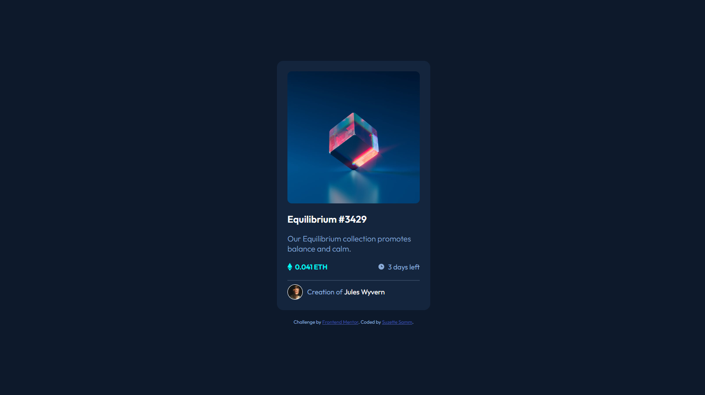

# Frontend Mentor - NFT preview card component solution

This is a solution to the [NFT preview card component challenge on Frontend Mentor](https://www.frontendmentor.io/challenges/nft-preview-card-component-SbdUL_w0U). Frontend Mentor challenges help you improve your coding skills by building realistic projects. 

## Table of contents

- [Overview](#overview)
  - [The challenge](#the-challenge)
  - [Screenshot](#screenshot)
  - [Links](#links)
- [My process](#my-process)
  - [Built with](#built-with)
  - [What I learned](#what-i-learned)
  - [Continued development](#continued-development)
  - [Useful resources](#useful-resources)
- [Author](#author)

**Note: Delete this note and update the table of contents based on what sections you keep.**

## Overview

Created an NFT preview acrd component using HTML and CSS.

### The challenge

Users should be able to:

- View the optimal layout depending on their device's screen size
- See hover states for interactive elements

### Screenshot

### Links

- Solution URL: [Github](https://github.com/SuzetteSa/fem-nft-preview-project)
- Live Site URL: [GitHub Pages]( https://suzettesa.github.io/fem-nft-preview-project/)

## My process

I started out by separating HTML content into divs and adding classes then adding CSS little by little to acheive the desired design.

### Built with

- Semantic HTML5 markup
- CSS custom properties
- Flexbox

### What I learned

I learned how to make an image overlay with opacity isolated to the background and the content fully opaque. I played around with CSS positioning as well.

### Continued development

I look forward to working on perfecting my layout skills with CSS.

### Useful resources

- [Figma](https://www.figma.com/) - Working off of Figma gave me more information and details about placement to acheive the design.
- [Image Hover Text Overlay Effect video on Youtube by dcode](https://www.youtube.com/watch?v=exb2ab72Xhs) - This is an amazing video which helped me finally understand Image overlays. I'd recommend it to anyone still learning this concept.

## Author

- Website - [Suzette Samm](https://www.suzettesamm.com)
- Frontend Mentor - [@SuzetteSa](https://www.frontendmentor.io/profile/SuzetteSa)
- LinkedIn - [@SuzetteSa](https://www.linkedin.com/in/suzette-samm/)
